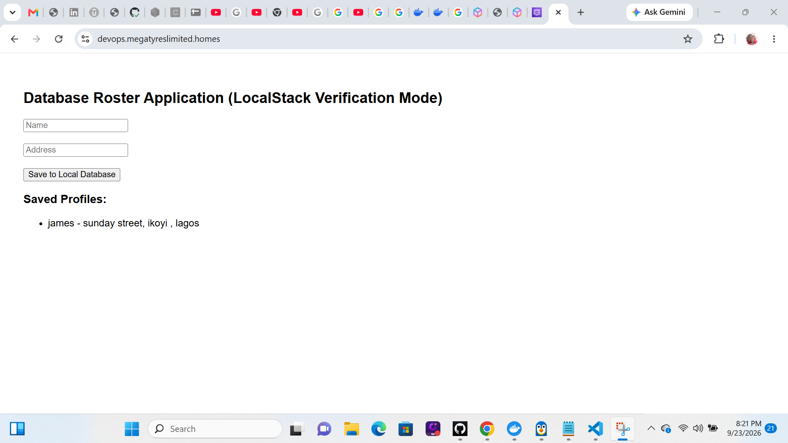

# Production 3-Tier AWS Infrastructure — Multi-AZ

A fully deployed, production-grade cloud infrastructure built on AWS using Terraform, Docker, and GitHub Actions. This project provisions a complete 3-tier architecture across multiple availability zones with zero manual server configuration.

**Live URL:** `http://public-alb-1368015696.us-east-1.elb.amazonaws.com`

---

## Screenshots

### Live Application


### GitHub Actions Pipeline


### Terraform Plan


### Final Deployment Push


---

## Architecture

```
[ Internet ]
     │
     ▼
[ Application Load Balancer ]  ← Public, Multi-AZ
     │
     ▼
[ Nginx Instances — ASG ]      ← Private Subnet 1, serves React static files
     │
     ▼
[ Internal ALB ]               ← Private, routes /api/ traffic
     │
     ▼
[ Node.js API — ASG ]          ← Private Subnet 2, connected to EFS
     │
     ▼
[ RDS PostgreSQL — Multi-AZ ]  ← Isolated DB Subnet, encrypted, hot standby
```

---

## Engineering Decisions

**Single NAT Gateway**
Deliberately uses one NAT Gateway across all private subnets instead of one per AZ. Reduces baseline infrastructure cost by ~60% while maintaining full outbound internet access for private instances — an intentional trade-off appropriate for cost-optimised environments.

**Zero-Trust Access — No Bastion Host**
All EC2 instances are accessed exclusively via AWS Systems Manager (SSM). No inbound port 22 is open anywhere in the infrastructure. This eliminates the most common attack vector in cloud environments.

**Static File Serving**
The React frontend is built on GitHub Actions runners (free) and synced directly to nginx via S3. Nginx serves static files from disk — no Node.js process running on the frontend tier, no container port conflicts, instant 200 responses for ALB health checks.

**CI/CD Pipeline**
GitHub Actions handles all build and deploy tasks. Docker images are compiled on free GitHub cloud runners to avoid memory pressure on t2.micro instances. The deploy job uses SSM to push updates to instances without any open network ports.

**Encrypted Everything**
- RDS storage encrypted at rest
- RDS connections require SSL (enforced by parameter group)
- EFS file system encrypted at rest
- Terraform state encrypted in S3 with DynamoDB state locking

**Observability**
CloudWatch monitors every layer of the stack. ALB unhealthy host and 5XX error alarms, EC2 CPU alarms on both ASGs, and RDS CPU and free storage alarms all feed into a single SNS topic. A CloudWatch dashboard gives a single-pane view of the entire infrastructure. Log groups capture nginx and backend application logs with 7-day retention.

---

## Stack

| Layer | Technology |
|---|---|
| Infrastructure as Code | Terraform >= 1.5.0 |
| Cloud Provider | AWS (us-east-1) |
| Compute | EC2 t2.micro, Auto Scaling Groups |
| Load Balancing | AWS ALB (public + internal) |
| Frontend | React 18, served via Nginx |
| Backend | Node.js, Express |
| Database | RDS PostgreSQL 15, Multi-AZ |
| Shared Storage | AWS EFS |
| Access Management | AWS SSM, IAM Roles |
| CI/CD | GitHub Actions, GHCR |
| State Management | S3 + DynamoDB |
| Monitoring | CloudWatch Alarms, Dashboards, SNS |

---

## Deployment

### Prerequisites
- AWS CLI configured (`aws configure`)
- Terraform >= 1.5.0

### 1. Create S3 state bucket and DynamoDB lock table
```bash
aws s3api create-bucket --bucket <your-unique-bucket-name> --region us-east-1
aws s3api put-bucket-versioning --bucket <your-unique-bucket-name> --versioning-configuration Status=Enabled
aws dynamodb create-table --table-name enterprise-tf-state-locks \
  --attribute-definitions AttributeName=LockID,AttributeType=S \
  --key-schema AttributeName=LockID,KeyType=HASH \
  --billing-mode PAY_PER_REQUEST --region us-east-1
```

### 2. Initialise and deploy
```bash
terraform init
terraform apply -auto-approve
```

### 3. Add GitHub Secrets
After apply completes, add these secrets to your GitHub repository under **Settings → Secrets and variables → Actions**:

| Secret | Value |
|---|---|
| `AWS_ACCESS_KEY_ID` | Your AWS access key |
| `AWS_SECRET_ACCESS_KEY` | Your AWS secret key |
| `AWS_RDS_ENDPOINT` | The `database_endpoint` output (without `:5432`) |

### 4. Trigger the pipeline
Push any change to `main` to build and deploy the application automatically.

---

## Cost

Designed to run within the AWS 12-month Free Tier using `t2.micro` instances. The only costs outside Free Tier are the NAT Gateway (~$0.045/hr) and Multi-AZ RDS if running beyond the free tier period.
